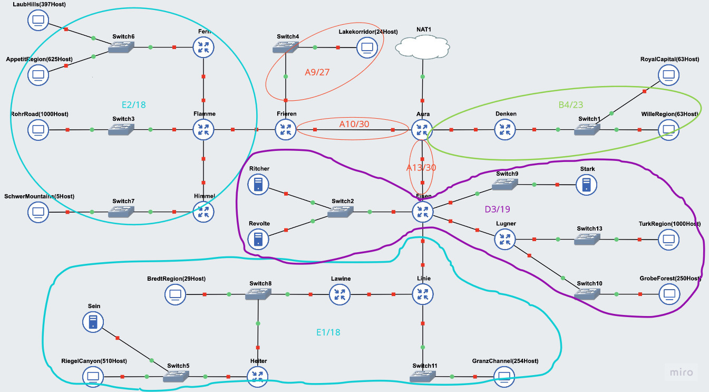

# Jarkom-Modul-4-F04-2023

## Anggota Kelompok

1. 5025211149 - Irsyad Fikriansyah Ramadhan
2. 5025211158 - Ghifari Maaliki Syafa Syuhada

| Kelompok | Prefix IP |
|----------|-----------|
| F04      | 192.223   |

Link spreadsheet perhitungan: <a href="https://docs.google.com/spreadsheets/d/1s6zThFMjVH1S3RKcH4FeIohUp0uV10fMOSu2JvUXQek/edit?usp=sharing">sheet</a>

## Topologi


## Rute


## VLSM - Cisco Packet Tracer

### Pembagian IP

#### Tabel kebutuhan

| Subnet | Kebutuhan host | Host tersedia | Usable host disediakan | Subnet mask | 
| - | - | - | - | - | 
| A1 | 1023 | 2048 | 2046 | /21 | 
| A19 | 1001 | 1024 | 1022 | /22 | 
| A2 | 1001 | 1024 | 1022 | /22 | 
| A4 | 512 | 1024 | 1022 | /22 | 
| A21 | 255 | 512 | 510 | /23 | 
| A20 | 251 | 256 | 254 | /24 | 
| A16 | 127 | 256 | 254 | /24 | 
| A7 | 31 | 64 | 62 | /26 | 
| A9 | 25 | 32 | 30 | /27 | 
| A3 | 6 | 8 | 6 | /29 | 
| A11 | 3 | 8 | 6 | /29 | 
| A10 | 2 | 4 | 2 | /30 | 
| A12 | 2 | 4 | 2 | /30 | 
| A13 | 2 | 4 | 2 | /30 | 
| A14 | 2 | 4 | 2 | /30 | 
| A15 | 2 | 4 | 2 | /30 | 
| A17 | 2 | 4 | 2 | /30 | 
| A18 | 2 | 4 | 2 | /30 | 
| A5 | 2 | 4 | 2 | /30 | 
| A6 | 2 | 4 | 2 | /30 | 
| A8 | 2 | 4 | 2 | /30 | 
| Total | 4255 | 8192 | 8190 | /19 |

#### Tabel Pembagian IP

| No | Network ID | Subnet Mask | Host | Network |
| - | - | - | - | - |
| 1 | 192.223.0.0 | /21 | 2048 | A1 |
| 2 | 192.223.8.0 | /22 | 1024 | A19 |
| 3 | 192.223.12.0 | /22 | 1024 | A2 |
| 4 | 192.223.16.0 | /22 | 1024 | A4 |
| 5 | 192.223.20.0 | /23 | 512 | A21 |
| 6 | 192.223.22.0 | /24 | 256 | A20 |
| 7 | 192.223.23.0 | /24 | 256 | A16 |
| 8 | 192.223.24.0 | /26 | 64 | A7 |
| 9 | 192.223.24.64 | /27 | 32 | A9 |
| 10 | 192.223.24.96 | /29 | 8 | A3 |
| 11 | 192.223.24.104 | /29 | 8 | A11 |
| 12 | 192.223.24.112 | /30 | 4 | A10 |
| 13 | 192.223.24.116 | /30 | 4 | A12 |
| 14 | 192.223.24.120 | /30 | 4 | A13 |
| 15 | 192.223.24.124 | /30 | 4 | A14 |
| 16 | 192.223.24.128 | /30 | 4 | A15 |
| 17 | 192.223.24.132 | /30 | 4 | A17 |
| 18 | 192.223.24.136 | /30 | 4 | A18 |
| 19 | 192.223.24.140 | /30 | 4 | A5 |
| 20 | 192.223.24.144 | /30 | 4 | A6 |
| 21 | 192.223.24.148 | /30 | 4 | A8 |
| 22 | 192.223.24.152 | /29 | 8 | unused |
| 23 | 192.223.24.160 | /27 | 32 | unused |
| 24 | 192.223.24.192 | /26 | 64 | unused |
| 25 | 192.223.25.0 | /24 | 256 | unused |
| 26 | 192.223.26.0 | /23 | 512 | unused |
| 27 | 192.223.28.0 | /22 | 1024 | unused |

### VLSM Tree


### Hasil Pembagian

| Subnet | Nama | IP |
| - | - | - |
| A1 | Network ID | 192.223.0.0 |
|  | Netmask | 255.255.248.0 |
|  | Broadcast Address | 192.223.7.255 |
| A2 | Network ID | 192.223.12.0 |
|  | Netmask | 255.255.252.0 |
|  | Broadcast Address | 192.223.15.255 |
| A3 | Network ID | 192.223.24.96 |
|  | Netmask | 255.255.255.248 |
|  | Broadcast Address | 192.223.24.103 |
| A4 | Network ID | 192.223.16.0 |
|  | Netmask | 255.255.252.0 |
|  | Broadcast Address | 192.223.19.255 |
| A5 | Network ID | 192.223.24.140 |
|  | Netmask | 255.255.255.252 |
|  | Broadcast Address | 192.223.24.143 |
| A6 | Network ID | 192.223.24.144 |
|  | Netmask | 255.255.255.252 |
|  | Broadcast Address | 192.223.24.147 |
| A7 | Network ID | 192.223.24.0 |
|  | Netmask | 255.255.255.192 |
|  | Broadcast Address | 192.223.24.63 |
| A8 | Network ID | 192.223.24.148 |
|  | Netmask | 255.255.255.252 |
|  | Broadcast Address | 192.223.24.151 |
| A9 | Network ID | 192.223.24.64 |
|  | Netmask | 255.255.255.224 |
|  | Broadcast Address | 192.223.24.95 |
| A10 | Network ID | 192.223.24.112 |
|  | Netmask | 255.255.255.252 |
|  | Broadcast Address | 192.223.24.115 |
| A11 | Network ID | 192.223.24.104 |
|  | Netmask | 255.255.255.248 |
|  | Broadcast Address | 192.223.24.111 |
| A12 | Network ID | 192.223.24.116 |
|  | Netmask | 255.255.255.252 |
|  | Broadcast Address | 192.223.24.119 |
| A13 | Network ID | 192.223.24.120 |
|  | Netmask | 255.255.255.252 |
|  | Broadcast Address | 192.223.24.123 |
| A14 | Network ID | 192.223.24.124 |
|  | Netmask | 255.255.255.252 |
|  | Broadcast Address | 192.223.24.127 |
| A15 | Network ID | 192.223.24.128 |
|  | Netmask | 255.255.255.252 |
|  | Broadcast Address | 192.223.24.131 |
| A16 | Network ID | 192.223.23.0 |
|  | Netmask | 255.255.255.0 |
|  | Broadcast Address | 192.223.23.255 |
| A17 | Network ID | 192.223.24.132 |
|  | Netmask | 255.255.255.252 |
|  | Broadcast Address | 192.223.24.135 |
| A18 | Network ID | 192.223.24.136 |
|  | Netmask | 255.255.255.252 |
|  | Broadcast Address | 192.223.24.139 |
| A19 | Network ID | 192.223.8.0 |
|  | Netmask | 255.255.252.0 |
|  | Broadcast Address | 192.223.11.255 |
| A20 | Network ID | 192.223.22.0 |
|  | Netmask | 255.255.255.0 |
|  | Broadcast Address | 192.223.22.255 |
| A21 | Network ID | 192.223.20.0 |
|  | Netmask | 255.255.254.0 |
|  | Broadcast Address | 192.223.21.255 |

## CIDR - GNS3

### CIDR Tree


### Pembagian Subnet CIDR
#### Iterasi 1
- Tabel


- Grafik


#### Iterasi 2
- Tabel


- Grafik


#### Iterasi 3
- Tabel


- Grafik


#### Iterasi 4
- Tabel


- Grafik



#### Iterasi 5
- Tabel


- Grafik


#### Iterasi 6
- Tabel


- Grafik


#### Iterasi 7
- Tabel


- Grafik


#### Iterasi 8
- Tabel


- Grafik


### Pembagian IP CIDR


### Konfigurasi IP GNS CIDR
- Aura (router)
```
auto eth0
iface eth0 inet dhcp

auto eth1
iface eth1 inet static
address 192.225.128.1
netmask 255.255.255.252

auto eth2
iface eth2 inet static
address 192.223.128.1
netmask 255.255.255.252

auto eth3
iface eth3 inet static
address 192.224.1.1
netmask 255.255.255.252
```

- Frieren (router)
```
auto eth0
iface eth0 inet static
address 192.225.1.2
netmask 255.255.255.252
gateway 192.225.1.1

auto eth1
iface eth1 inet static
address 192.225.64.1
netmask 255.255.255.224

auto eth2
iface eth2 inet static
address 192.225.32.1
netmask 255.255.255.252
```

- LakeKorridor (client)
```
auto eth0
iface eth0 inet static
address 192.225.64.2
netmask 255.255.255.224
gateway 192.225.64.1
```

- Flamme (router)
```
auto eth0
iface eth0 inet static
address 192.225.32.2
netmask 255.255.255.252
gateway 192.225.32.1

auto eth1
iface eth1 inet static
address 192.225.8.1
netmask 255.255.255.252

auto eth2
iface eth2 inet static
address 192.225.20.9
netmask 255.255.255.252

auto eth3
iface eth3 inet static
address 192.225.16.1
netmask 255.255.252.0
```

- Himmel (router)
```
auto eth0
iface eth0 inet static
address 192.225.20.10
netmask 255.255.255.252
gateway 192.225.20.9

auto eth1
iface eth1 inet static
address 192.225.20.1
netmask 255.255.255.248
```

- Fern (router)
```
auto eth0
iface eth0 inet static
address 192.225.8.2
netmask 255.255.255.252
gateway 192.225.8.1

auto eth1
iface eth1 inet static
address 192.225.0.1
netmask 255.255.248.0
```

- RohrRoad (client)
```
auto eth0
iface eth0 inet static
address 192.225.16.2
netmask 255.255.252.0
gateway 192.225.16.1
```

- SchwerMountains (client)
```
auto eth0
iface eth0 inet static
address 192.225.20.2
netmask 255.255.255.248
gateway 192.225.20.1
```

- LaubHills (client)
```
auto eth0
iface eth0 inet static
address 192.225.0.2
netmask 255.255.248.0
gateway 192.225.0.1
```

- AppetitRegion (client)
```
auto eth0
iface eth0 inet static
address 192.225.0.3
netmask 255.255.248.0
gateway 192.225.0.1
```

- Denken (router)
```
auto eth0
iface eth0 inet static
address 192.224.1.2
netmask 255.255.255.252
gateway 192.225.1.1

auto eth1
iface eth1 inet static
address 192.224.0.1
netmask 255.255.255.0
```

- WillieRegion (client)
```
auto eth0
iface eth0 inet static
address 192.224.0.2
netmask 255.255.255.0
gateway 192.224.0.1
```

- RoyalCapital (client)
```
auto eth0
iface eth0 inet static
address 192.224.0.3
netmask 255.255.255.0
gateway 192.224.0.1
```

- Eisen (router)
```
auto eth0
iface eth0 inet static
address 192.223.128.2
netmask 255.255.255.252
gateway 192.223.128.1

auto eth1
iface eth1 inet static
address 192.223.80.1
netmask 255.255.255.248

auto eth2
iface eth2 inet static
address 192.223.32.1
netmask 255.255.255.252

auto eth3
iface eth3 inet static
address 192.223.80.9
netmask 255.255.255.252

auto eth4
iface eth4 inet static
address 192.223.72.1
netmask 255.255.255.252
```

- Revolte (server)
```
auto eth0
iface eth0 inet static
address 192.223.80.2
netmask 255.255.255.248
gateway 192.223.80.1
```

- Richter (server)
```
auto eth0
iface eth0 inet static
address 192.223.80.3
netmask 255.255.255.248
gateway 192.223.80.1
```

- Stark (server)
```
auto eth0
iface eth0 inet static
address 192.223.80.10
netmask 255.255.255.252
gateway 192.223.80.9
```

- Lugner (router)
```
auto eth0
iface eth0 inet static
address 192.223.72.2
netmask 255.255.255.252
gateway 192.223.72.1

auto eth1
iface eth1 inet static
address 192.223.64.1
netmask 255.255.252.0

auto eth2
iface eth2 inet static
address 192.223.68.1
netmask 255.255.255.0
```

- GrobeForest (client)
```
auto eth0
iface eth0 inet static
address 192.223.68.2
netmask 255.255.255.0
gateway 192.223.68.1
```

- TurkRegion (client)
```
auto eth0
iface eth0 inet static
address 192.223.64.2
netmask 255.255.255.0
gateway 192.223.64.1
```

- Linie (router)
```
auto eth0
iface eth0 inet static
address 192.223.32.2
netmask 255.255.255.252
gateway 192.223.32.1

auto eth1
iface eth1 inet static
address 192.223.8.1
netmask 255.255.255.252

auto eth2
iface eth2 inet static
address 192.223.16.1
netmask 255.255.254.0
```

- GranzChannel (client)
```
auto eth0
iface eth0 inet static
address 192.223.16.2
netmask 255.255.254.0
gateway 192.223.16.1
```

- Lawine (router)
```
auto eth0
iface eth0 inet static
address 192.223.8.2
netmask 255.255.255.252
gateway 192.223.8.1

auto eth1
iface eth1 inet static
address 192.223.4.1
netmask 255.255.255.192
```

- BredtRegion (client)
```
auto eth0
iface eth0 inet static
address 192.223.4.3
netmask 255.255.255.192
gateway 192.223.4.1
```

- Heiter (router)
```
auto eth0
iface eth0 inet static
address 192.223.4.3
netmask 255.255.255.192
gateway 192.223.4.1

auto eth1
iface eth1 inet static
address 192.223.0.1
netmask 255.255.252.0
```

- RiegelCanyon (client)
```
auto eth0
iface eth0 inet static
address 192.223.0.2
netmask 255.255.252.0
gateway 192.223.0.1
```

- Sein (server)
```
auto eth0
iface eth0 inet static
address 192.223.0.3
netmask 255.255.252.0
gateway 192.223.0.1
```
